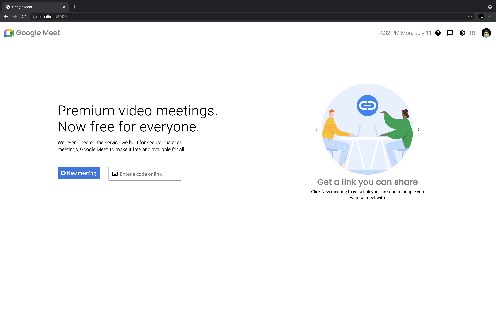
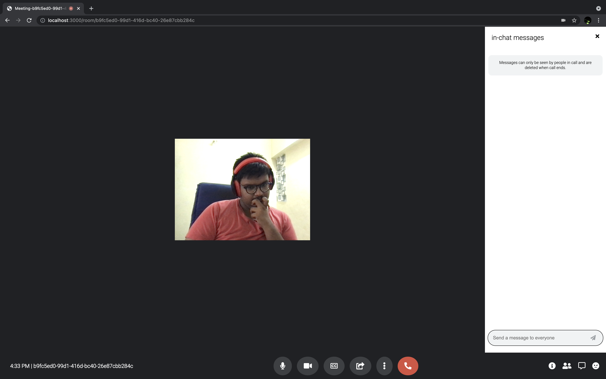

# Google Meet Clone

For this project, plan is to try using a MongoDB, Express.js framework, and scoket.io for real-time events. Firstly, had plans to make
a real-time chat app but later thought of extending this project to a complete google meet clone.
<!--Hello world-->

# Action Plan:

Firsly, The Frontend of the Home Page is made with html (Yeah, Very Very Silly. i was learning react when i was building this so didn't want to experiment).Lollll.

- I first made the Homepage
- Initialized Nodejs Project
- create a room view (i used ejs for this project though generally i use pug. just wanted to try out ejs.)
- Creating a room id using uuid package.
- Added the feature of viewing our own video first
- Added the feature to allow others to stream their videos
- Styling the room to match google meet
- Ability to send and recieve messages
- Adding buttons in the video chat Ex: Mute/unmute, video on/off

